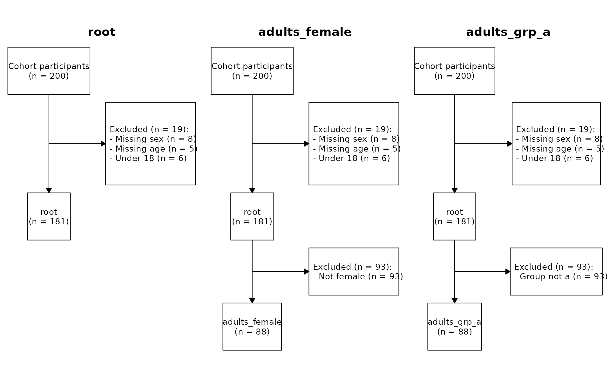
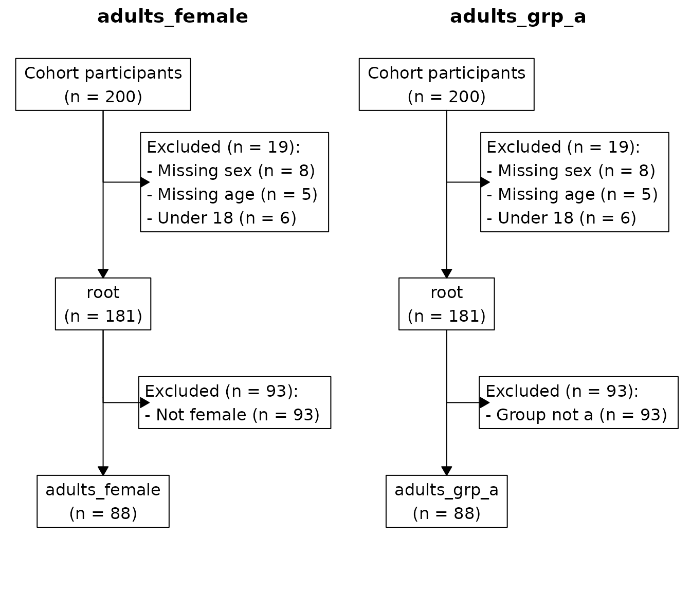

# Cohort construction with provenance

`cohort` provides one R6 class, `CohortPipeline`. It builds analytic
cohorts with full provenance. Cohort construction stays strictly
upstream of analysis. The pipeline produces analytic data tables, then
hands them to whatever consumes them downstream.

## A worked example

We start with a small simulated dataset.

``` r
library(cohort)
#> cohort 2026.8.6
#> https://www.rwhite.no/cohort/
library(data.table)
#> 
#> Attaching package: 'data.table'
#> The following object is masked from 'package:base':
#> 
#>     %notin%

set.seed(1)
d <- data.table(
  id  = 1:200,
  age = sample(c(NA, 16:80), 200, replace = TRUE),
  sex = sample(c("F", "M", NA), 200, replace = TRUE,
               prob = c(0.48, 0.48, 0.04)),
  grp = sample(c("a", "b"), 200, replace = TRUE)
)
```

### Step 1: install a base table

``` r
cp <- CohortPipeline$new(
  d,
  cache_file = file.path(tempdir(), "cohort_cache.rds"),
  label      = "Eligible patients"
)
on.exit(cp$save(), add = TRUE)
```

`CohortPipeline$new()` makes a defensive copy of `d` once. The pipeline
never mutates your data table, whatever operations you run on it.

The `cache_file` argument enables incremental re-execution. On the first
run the pipeline writes a snapshot to disk. On later runs it restores
the snapshot, and matching operations replay instantly with no
recomputation. The `label` argument is the cohort’s display label in
CONSORT diagrams, and defaults to `"Cohort participants"`. The
identifier `"root"` is universal, and code always uses it.

### Step 2: apply root-level exclusions

Every exclusion takes a human-readable reason and an R expression as a
string. The pipeline parses the string and evaluates it against the rows
currently included on the branch.

``` r
cp$exclude_and_track("root", "Missing sex", "is.na(sex)")
cp$exclude_and_track("root", "Missing age", "is.na(age)")
cp$exclude_and_track("root", "Under 18",    "age < 18")
```

The pipeline treats `NA` predicate results as `FALSE` and keeps those
rows. You therefore do not need a defensive `!is.na(...)` clause for
every column.

### Step 3: branch into sub-cohorts

``` r
cp$new_cohort("adults_female", from = "root", label = "Adult females")
cp$exclude_and_track("adults_female", "Not female", "sex != 'F'")

cp$new_cohort("adults_grp_a", from = "root",
              label = "Adults, group A")
cp$exclude_and_track("adults_grp_a", "Group not a", "grp != 'a'")
```

Your code references identifiers (`"adults_female"`, `"adults_grp_a"`).
Figures show labels. Call `new_cohort()` again with a different label.
The pipeline updates the label silently and does not invalidate the
cache.

A branch starts identical to its parent at the moment of branching.
Sibling branches evolve independently.

### The freeze rule

A cohort becomes **frozen** the first time either:

1.  another cohort branches from it, or
2.  an artifact is set on it.

After a cohort freezes, `$exclude_and_track()` on it errors. The rule
guarantees that a cohort’s name maps to one definition forever. Once
children depend on a cohort, its exclusion list is fixed. The practical
workflow is: apply all exclusions on a cohort, then branch from it or
attach artifacts. Multi-way forks are unaffected. You can branch a
frozen cohort as many times as you like.

### Step 4: derive cached artifacts

`set_artifact()` is for reusable per-cohort objects (analytic-ready data
tables, summary statistics, baseline tables). Each callback receives a
copy of the included rows. It also receives the named list of artifacts
already attached to the cohort.

``` r
cp$set_artifact("dt_for_analysis",
  from = "adults_female",
  fn = function(dt, sib) {
    dt[, age_group := cut(age,
      breaks = c(18, 30, 50, Inf),
      right = FALSE,
      labels = c("18-29", "30-49", "50+"))]
    dt
  }
)
```

Each `set_artifact()` callback receives a *fresh* copy of the cohort’s
included rows. It does not see changes that previous artifacts made. To
chain derivations, read the previous artifact from the `sib` argument:

``` r
cp$set_artifact("baseline_table",
  from = "adults_female",
  fn = function(dt, sib) {
    sib$dt_for_analysis[, .(.N, mean_age = mean(age)),
      by = age_group][order(age_group)]
  }
)
```

### Step 5: inspect the cohort tree

``` r
print(cp)
#> <CohortPipeline>
#> root: loaded = 200, included = 181, excluded = 19, 3 exclusion step(s)
#>   adults_female: branched from root at n = 181, own excluded = 93, included = 88, 1 own step(s)
#>     $ dt_for_analysis
#>     $ baseline_table
#>   adults_grp_a: branched from root at n = 181, own excluded = 93, included = 88, 1 own step(s)
cp$list_cohorts()
#>             name parent n_total n_included n_excluded n_own_steps n_artifacts
#>           <char> <char>   <int>      <int>      <int>       <int>       <int>
#> 1:          root   <NA>     200        181         19           3           0
#> 2: adults_female   root     200         88        112           1           2
#> 3:  adults_grp_a   root     200         88        112           1           0
#>    frozen
#>    <lgcl>
#> 1:   TRUE
#> 2:   TRUE
#> 3:  FALSE
cp$consort()
#>           branch parent  step      reason   expr_str n_excluded n_remaining
#>           <char> <char> <int>      <char>     <char>      <int>       <int>
#> 1:          root   <NA>     1 Missing sex is.na(sex)          8         192
#> 2:          root   <NA>     2 Missing age is.na(age)          5         187
#> 3:          root   <NA>     3    Under 18   age < 18          6         181
#> 4: adults_female   root     4  Not female sex != 'F'         93          88
#> 5:  adults_grp_a   root     4 Group not a grp != 'a'         93          88
```

`$consort()` returns a long-form table — one row per exclusion step,
across every branch. Each branch contributes only its own steps. A step
that a branch inherits from its parent appears under the parent.

### Step 6: hand off downstream

Cached artifacts are plain R objects. Read them with `$get_artifact()`,
then pass them to whatever consumes the analytic data.

``` r
analytic_dt <- cp$get_artifact("adults_female", "dt_for_analysis")
baseline    <- cp$get_artifact("adults_female", "baseline_table")

head(analytic_dt)
#>       id   age    sex    grp age_group
#>    <int> <int> <char> <char>    <fctr>
#> 1:     3    48      F      b     30-49
#> 2:     5    28      F      a     18-29
#> 3:     6    73      F      b       50+
#> 4:     9    68      F      a       50+
#> 5:    10    21      F      b     18-29
#> 6:    14    58      F      a       50+
baseline
#>    age_group     N mean_age
#>       <fctr> <int>    <num>
#> 1:     18-29    14 25.14286
#> 2:     30-49    30 39.80000
#> 3:       50+    44 63.54545
```

If you use an analysis-orchestration package, register each artifact as
a named data entry — typically one short loop over
`cp$list_artifacts()`.

## Schemas

Use schemas to declare a column-type contract on a branch and verify it
before downstream code consumes the data.

``` r
cp$declare_schema("adults_female", schema = list(
  age = list(type = "numeric",   na = FALSE),
  sex = list(type = "character", na = FALSE)
))
cp$validate()
#> [validate] All CohortPipeline schemas passed
```

If a column is missing, has the wrong type, or carries unexpected `NA`s,
`$validate()` throws one error that lists every problem. Pass
`auto_validate = TRUE` to `CohortPipeline$new()` to fail at the failure
site. Every `$new_cohort()` and `$set_artifact()` call then validates
after it runs.

## CONSORT diagrams

The simplest way to draw CONSORT diagrams is `$plot()`. With no
arguments it renders one panel per cohort. Each panel walks the
root-to-cohort path, and cohort names become box labels.

``` r
cp$plot()
```



You can name specific cohorts:

``` r
cp$plot(c("adults_female", "adults_grp_a"))
```



Or save to disk:

``` r
cp$plot(file = "Figure_1_CONSORT.pdf")
```

For full control over labels, panel titles, side branches and layout,
use `$draw_consort_panels()` (see
[`?CohortPipeline`](https://www.rwhite.no/cohort/reference/CohortPipeline.md)).

## How the cache decides what to recompute

The worked example already uses `cache_file` and `on.exit(cp$save())`.
On the second run of the same script, the pipeline checks every
operation against the cached log.

| Method              | Cache key                        |
|---------------------|----------------------------------|
| `exclude_and_track` | `(branch, reason, expr_str)`     |
| `new_cohort`        | `(name, from)`                   |
| `declare_schema`    | overwrites; not cached           |
| `set_artifact`      | `(name, from, body(fn), argset)` |

A match advances the replay cursor with no work done. A mismatch
truncates the log at that point and drops downstream artifacts. It also
cascades to descendant cohorts whose inherited prefix is now stale. It
then recomputes only what changed. Labels are presentation, not part of
the cache key. Call
`new_cohort("adults_female", from = "root", label = "Adult women")`
again, and the pipeline updates the label. It invalidates nothing.

For `set_artifact`, you SHOULD use the 3-argument signature
`function(dt, sib, argset)`. Data dependencies in `argset` participate
in the cache key. A change from `argset = list(washout = 84L)` to
`washout = 90L` therefore triggers a recompute. The 2-argument form
`function(dt, sib)` still works. It does not catch closure-captured
changes.

The cache key uses `body(fn)` literally. If `fn` calls a helper that you
change, the cache cannot detect the change. Either include a version tag
in `argset`, or call `cp$invalidate(cohort)` to drop the cohort and
force a recompute.

## Mutation contract (summary)

| Method                      | Returns                    | Mutation safe? |
|-----------------------------|----------------------------|----------------|
| `$get_included(c)`          | Independent copy           | Yes            |
| Callback in `$set_artifact` | Independent copy of subset | Yes            |
| `$get_everyone(c)`          | Independent copy + status  | Yes            |

Operations that go through the public API never modify the user’s input
data table or another branch.

## Performance notes

- Branching is O(n) in the number of rows of the base table. The data
  values themselves are stored once and shared across the tree.
- `$exclude_and_track()` evaluates the predicate against the included
  subset only. A predicate can therefore assume that earlier exclusions
  already removed invalid rows.
- The exclusion log accumulates as a list. It materializes as a
  `data.table` only on read (`$consort()`, `$list_cohorts()`). That
  avoids quadratic `rbind` growth.
